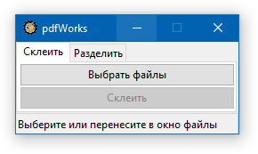
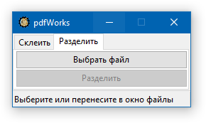

## pdfWorks

pdfWorks-lib is a GUI application for Windows 
based on `pdfWorks-lib`'s tools written on `python` using `wxPython`.

There are two tabs for each tool:

Yes, the language is Russian only.

### Convert tab
Pick the files from browsing window or drag'n'drop them on the app. 
Then click ConvertAndMerge button to choose the output file.
### Split tab
Pick the file from browsing window or drag'n'drop it on the app. 
Then click Split button to select the output directory where all the files will be put.